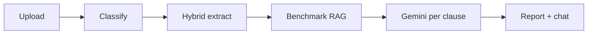

# LexGuard

**AI contract intelligence** — understand what you sign *before* you sign it.

[](https://github.com/chxmq/lexguard/actions/workflows/ci.yml)
[](https://lexguard-api-319474876307.asia-northeast1.run.app)
[](package.json)
[](LICENSE)

| | |
|---|---|
| **Live app** | https://lexguard-api-319474876307.asia-northeast1.run.app |
| **Repository** | https://github.com/chxmq/lexguard |
| **Stack** | React · Express · Vertex AI Gemini 2.5 · Firestore · GCS |

LexGuard analyzes employment, SaaS, NDA, privacy, and vendor agreements from the **signing party’s perspective**: extract clauses, score risk, compare to market benchmarks, detect cross-clause contradictions, and suggest redlines — with plain-language explanations.

> **Not legal advice.** Decision-support only. See in-app disclaimer.

---

## Why LexGuard

| Problem | LexGuard response |
|---------|-------------------|
| Contracts are unreadable | Plain-language implications + worst-case scenarios per clause |
| Hidden one-sided terms | Severity scoring, benchmark deviation, exploitative-pattern detection |
| Contradictions across sections | Cross-clause heuristics (+ optional Vertex merge) |
| Generic AI summaries | Structured JSON: classify → explain → compare → negotiate |

**Hack2Skill / Google Antigravity** — legal & contract risk vertical. Public `main` branch, source-only repo (&lt;10 MB without `node_modules`).

---

## How it works



1. **Ingest** — PDF, DOCX, text, URL, or image (OCR).
2. **Classify** — document type + signing party (Vertex).
3. **Extract** — schema heuristics; optional **one** LLM call if coverage is low.
4. **Analyze** — per clause: severity, implications, corpus comparison, adversarial verdict, redline.
5. **Cross-clause** — contradictions & ambiguous language (heuristics always on).
6. **Report** — risk score, radar, Q&A, PDF export.

**Typical Vertex usage:** ~9–11 Gemini calls per contract; **0 embedding calls** in production (`category-first` RAG).

---

## Quick start

```bash
git clone https://github.com/chxmq/lexguard.git
cd lexguard
npm install
cp .env.example .env
# Edit: GOOGLE_CLOUD_PROJECT, GOOGLE_APPLICATION_CREDENTIALS, VERTEX_AI_LOCATION

npm run setup-gcp      # once — GCP Owner account
npm run check-vertex   # verify Vertex access
npm test
npm run eval:extract   # benchmark demos (no Vertex quota)
npm run dev            # http://localhost:5173
```

**Try these demos:**

| File | What to look for |
|------|------------------|
| `demo/sample_employment_contract.txt` | Non-compete, IP grab, **30 vs 60 day notice** contradiction |
| `demo/sample_saas_subscription.txt` | Auto-renewal, INR 1k liability cap, Singapore arbitration |
| `demo/sample_privacy_policy.txt` | Excessive data collection, weak rights |

---

## Features

| Capability | Description |
|------------|-------------|
| Multi-format ingestion | PDF (+ scanned OCR), DOCX, text, URL, images |
| Hybrid extraction | Heuristics + optional LLM segmenter (`LEXGUARD_LLM_EXTRACT=auto`) |
| Grounded analysis | 35+ benchmark clauses in `corpus/` |
| Cross-clause intelligence | Heuristics always; Vertex merge optional |
| Report workspace | Highlights, clause list, risk radar, chat, export |
| Rate-limit safe | Shared Vertex queue, category-first RAG — see [RATE_LIMITS](docs/RATE_LIMITS.md) |

---

## Project structure

```
lexguard/
├── src/client/          # React UI (Vite + Tailwind)
├── src/server/          # Express API, analysis pipeline, RAG
├── src/shared/          # Cross-clause heuristics, constants, clause utils
├── corpus/              # Benchmark clause library (committed)
├── demo/                # Sample contracts for judges
├── eval/                # Expected findings for benchmarks
├── docs/                # Architecture, methodology, judging guide
├── scripts/             # GCP setup, deploy, eval, e2e
└── tests/               # Unit tests (node:test)
```

---

## Configuration

Copy [`.env.example`](.env.example). Minimum:

```env
GOOGLE_CLOUD_PROJECT=your-project-id
GOOGLE_APPLICATION_CREDENTIALS=./service-account.json
VERTEX_AI_LOCATION=asia-northeast1
LEXGUARD_DEMO_MODE=false
```

**Production / demo-friendly rate limits:**

```env
VERTEX_MAX_CONCURRENT=1
VERTEX_MIN_INTERVAL_MS=3000
LEXGUARD_RAG_MODE=category-first
LEXGUARD_RUNTIME_EMBEDDINGS=local
LEXGUARD_CROSS_CLAUSE_AI=false
LEXGUARD_LLM_EXTRACT=auto
```

---

## Scripts

| Command | Description |
|---------|-------------|
| `npm run dev` | Vite + API (ports 5173 / 3050) |
| `npm test` | Unit tests |
| `npm run eval:extract` | Demo benchmark (no Vertex) |
| `npm run eval` | Full pipeline benchmark |
| `npm run build` | Production frontend → `dist/` |
| `npm run start` | Serve `dist/` + API |
| `npm run check-vertex` | Vertex connectivity probe |
| `npm run embed-corpus` | Build local vector index (offline) |
| `npm run e2e` | End-to-end analysis script |
| `./scripts/deploy-cloud-run.sh` | Deploy to Cloud Run |
| `./scripts/setup-gcp.sh` | Enable APIs + IAM |

---

## API

| Method | Path | Description |
|--------|------|-------------|
| `GET` | `/api/health` | Status, RAG mode, Vertex queue config |
| `POST` | `/api/analyze` | Start analysis (JSON, file, or URL) |
| `GET` | `/api/analyze/:id/stream` | SSE progress |
| `GET` | `/api/analyze/:id/status` | Poll status |
| `GET` | `/api/session/:id` | Report JSON |
| `POST` | `/api/chat` | Contract Q&A |

---

## Deployment (Cloud Run)

```bash
./scripts/deploy-cloud-run.sh
```

Uses your `.env` for `DOCUMENT_AI_PROCESSOR_ID`, bucket name, etc. Do **not** bake service account JSON into the image — Cloud Run uses IAM.

---

## Google Cloud services

| Service | Role |
|---------|------|
| Vertex AI (Gemini 2.5) | Classification, analysis, chat, OCR |
| Vertex Embeddings | Corpus indexing (`embed-corpus` only) |
| Firestore | Session persistence |
| Cloud Storage | Uploaded files |
| Document AI | Optional OCR |
| Cloud Run | Production hosting |

---

## Quality & testing

```bash
npm run test:all    # unit + benchmarks + API integration (no Vertex quota)
```

| Layer | Command | Count |
|-------|---------|-------|
| Unit + a11y | `npm run test:unit` | 25+ assertions |
| Demo benchmarks | `npm run eval:extract` | 3 contracts, 100% target |
| API integration | `npm run test:integration` | Full analyze flow in demo mode |

See **[docs/TESTING.md](docs/TESTING.md)** for the full strategy (what each suite proves for judges).

**Code organization:** `src/server/app.js` (testable Express factory), `src/shared/analysis-constants.js`, `src/server/lib/logger.js`, `src/server/lib/demo-mode.js` for CI.

---

## Documentation

| Doc | Purpose |
|-----|---------|
| [JUDGING.md](docs/JUDGING.md) | 3-minute judge walkthrough |
| [EVALUATION.md](docs/EVALUATION.md) | Measurable benchmarks |
| [ARCHITECTURE.md](docs/ARCHITECTURE.md) | System design |
| [METHODOLOGY.md](docs/METHODOLOGY.md) | AI workflow & limitations |
| [RATE_LIMITS.md](docs/RATE_LIMITS.md) | Avoid 429 errors |
| [DEMO_SCRIPT.md](docs/DEMO_SCRIPT.md) | Live presentation script |
| [PRESENTATION.md](docs/PRESENTATION.md) | Slide outline |
| [TESTING.md](docs/TESTING.md) | Automated test strategy (unit, integration, benchmarks) |

---

## Troubleshooting

| Issue | Fix |
|-------|-----|
| `429` rate limits | [docs/RATE_LIMITS.md](docs/RATE_LIMITS.md) |
| Blank report | `LEXGUARD_DEMO_MODE=false`, valid GCP credentials |
| Session not found after restart | Re-upload; Firestore may still have report at `/api/session/:id` |
| Port in use | Change `PORT` in `.env` |

---

## Security

- Never commit `.env`, service account keys, or OAuth secrets.
- Use a dedicated GCP project for demos (contracts may contain PII).
- Outputs are informational, not legal advice.

---

## License

[MIT](LICENSE) — 2026
