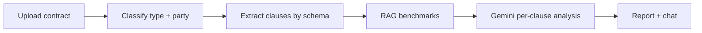
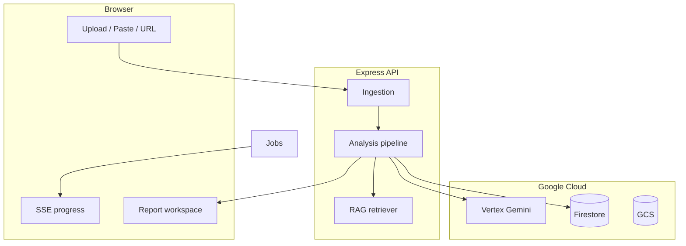

# LexGuard

**AI contract intelligence** — a context-aware legal assistant that helps people understand what they sign *before* they sign it.

> **Hack2Skill / Google Antigravity submission** — public repo, single branch (`main`), source-only (&lt; 10 MB without `node_modules`).

---

## Hack2Skill submission summary

### Chosen vertical

**Legal & contract risk assistant** (smart dynamic assistant for individuals reviewing agreements)

LexGuard targets anyone signing employment, freelance, NDA, SaaS, vendor, or rental contracts — especially where they are the weaker party (e.g. employee, freelancer, customer). The assistant adapts its analysis to **document type** and **signing party**, not generic chat.

### Approach and logic

| Principle | Implementation |
|-----------|----------------|
| **Context-first** | Gemini classifies document type + signing party before analysis |
| **Structured reasoning** | Schema-driven clause extraction (10 contract types), then per-clause AI |
| **Grounded answers** | RAG over market benchmark clauses (`corpus/`) + Vertex embeddings |
| **Transparent risk** | Severity, deviation vs benchmarks, plain-language implications, redline suggestions |
| **Dynamic assistant** | In-report chat uses session clauses + optional focused clause category |

**Decision flow:**

1. Ingest contract (file, paste, or URL).
2. Classify → pick extraction schema (employment, NDA, etc.).
3. Extract clauses → flag missing high-risk sections.
4. For each clause: retrieve benchmarks → single Gemini JSON (classify, explain, compare, negotiate).
5. Optional cross-clause pass for contradictions and ambiguity.
6. Aggregate weighted risk score → interactive report workspace.

### How the solution works



**User journey**

1. Open the app → upload `demo/sample_employment_contract.txt`, paste text, or add a PDF/URL.
2. Watch live progress (SSE) while Vertex AI analyzes each clause.
3. Open the **report workspace**: highlighted document, clause list, severity badges, risk radar, redlines, Q&A chat.
4. Export a PDF summary or connect Google account for Docs/Slides.

**Google services used**

| Service | Role |
|---------|------|
| **Vertex AI (Gemini 2.5)** | Classification, clause analysis, chat, image OCR |
| **Vertex AI Embeddings** | `text-embedding-004` for RAG |
| **Vertex Vector Search** | Optional managed similarity search |
| **Document AI** | Optional OCR for complex PDFs |
| **Cloud Firestore** | Session / report persistence |
| **Cloud Storage** | Uploaded document storage |
| **Google OAuth** | Docs & Slides export |

### Assumptions

- Users have or can create a **GCP project** with Vertex AI enabled (judges run locally with `.env` + service account, or use your deployed Cloud Run URL).
- Analysis quality is highest for **English** contracts; Indian jurisdiction is referenced in prompts where relevant.
- **Not a substitute for a licensed attorney** — outputs are decision support, not legal advice.
- `LEXGUARD_DEMO_MODE=false` is required for real AI (demo mode is for offline UI testing only).
- Rate limits: clause analysis is intentionally **sequential/throttled** (`GEMINI_CLAUSE_CONCURRENCY`) to stay within Vertex quotas.
- OAuth export requires the judge to configure `GOOGLE_CLIENT_ID` / `SECRET`; PDF export works without OAuth.

### Submission checklist

| Rule | Status |
|------|--------|
| Public GitHub repository | Required at submit time |
| Single branch (`main`) | Do not use extra long-lived branches |
| Repository &lt; 10 MB | Commit **source only** — `node_modules/`, `dist/`, `.env`, keys are gitignored |
| Complete code in repo | `src/`, `corpus/`, `demo/`, `scripts/`, `tests/` |
| README (this file) | Vertical, approach, how it works, assumptions |

**Before pushing:** run `npm install` locally only; never commit `node_modules` or `dist/`.

```bash
# Verify repo footprint (source only, typical: < 1 MB)
git ls-files | xargs du -ch 2>/dev/null | tail -1
npm test && npm run build
```

---

## Evaluation alignment

| Criterion | How LexGuard addresses it |
|-----------|---------------------------|
| **Code quality** | `src/client` + `src/server` + `src/shared`; kebab-case modules; no legacy dead agents |
| **Security** | Secrets gitignored; least-privilege SA; no keys in Docker image on Cloud Run |
| **Efficiency** | Combined Gemini call per clause; embedding cache via local index; rate-limit backoff |
| **Testing** | `npm test` (unit tests) + `npm run smoke` / `check-vertex` + GitHub Actions CI |
| **Accessibility** | Semantic HTML, contrast-focused dark UI, keyboard-friendly forms, readable typography |
| **Google services** | Vertex AI, Firestore, GCS, Document AI, Vector Search, OAuth — see table above |

---

## Table of contents

- [Features](#features)
- [Tech stack](#tech-stack)
- [Architecture](#architecture)
- [Repository layout](#repository-layout)
- [Prerequisites](#prerequisites)
- [Quick start](#quick-start)
- [Configuration](#configuration)
- [Development](#development)
- [Analysis pipeline](#analysis-pipeline)
- [API reference](#api-reference)
- [Scripts](#scripts)
- [Deployment](#deployment)
- [Security](#security)
- [Troubleshooting](#troubleshooting)
- [License](#license)

---

## Features

| Capability | Description |
|------------|-------------|
| **Multi-format ingestion** | PDF, DOCX, plain text, URL (bot-block fallback), images (Gemini vision OCR) |
| **Document classification** | Gemini identifies contract type and signing party |
| **Schema extraction** | Rule-based clause extraction for 10 document types |
| **Clause analysis** | Severity, implications, benchmark comparison, negotiation guidance |
| **Benchmark RAG** | Local corpus + embeddings; optional Vertex Vector Search |
| **Cross-clause review** | Optional AI panel (`LEXGUARD_CROSS_CLAUSE_AI=true`) |
| **Live progress** | Server-Sent Events during analysis |
| **Report workspace** | Document highlights, clause list, insights, risk radar, chat |
| **Export** | PDF; Google Docs/Slides with OAuth |

---

## Tech stack

| Layer | Technology |
|-------|------------|
| Frontend | React 18, Vite 6, Tailwind CSS, React Router |
| Backend | Node.js 20+, Express |
| AI | Vertex AI — Gemini 2.5 Flash / Pro |
| Data | Firestore, GCS |
| Deploy | Docker, Cloud Run |

---

## Architecture



---

## Repository layout

```
lexguard/
├── src/client/          # React UI
├── src/server/          # Express API + modules
├── src/shared/          # Shared utilities
├── corpus/              # RAG benchmark texts (commit)
├── demo/                # Sample contract for judges
├── scripts/             # GCP setup, health checks
├── tests/               # Unit tests (npm test)
└── .github/workflows/   # CI
```

| Path | Commit? | Notes |
|------|---------|-------|
| `src/`, `corpus/`, `demo/`, `scripts/`, `tests/` | Yes | Application source |
| `node_modules/`, `dist/`, `.env`, `*.json` keys | **No** | Generated or secret |
| `corpus/.vector-index.json` | No | Run `npm run embed-corpus` after clone |

---

## Prerequisites

- Node.js ≥ 20, npm ≥ 9
- Google Cloud project (Vertex AI, Firestore, Storage)
- [Google Antigravity](https://antigravity.google/) or any editor — clone repo and use `.env`
- Git + public GitHub repository

---

## Quick start

```bash
npm install
cp .env.example .env
# Set GOOGLE_CLOUD_PROJECT, GOOGLE_APPLICATION_CREDENTIALS, VERTEX_AI_LOCATION

npm run setup-gcp      # once (GCP Owner)
npm run check-vertex   # verify Gemini + embeddings
npm run embed-corpus   # local RAG index
npm test               # unit tests
npm run dev            # http://localhost:5173
```

Upload **`demo/sample_employment_contract.txt`** for a 2-minute end-to-end demo.

| Service | URL |
|---------|-----|
| Web UI | http://localhost:5173 |
| API health | http://localhost:3050/api/health |

---

## Configuration

See [`.env.example`](.env.example). Minimum for judging:

```env
GOOGLE_CLOUD_PROJECT=your-project
GOOGLE_APPLICATION_CREDENTIALS=./service-account.json
VERTEX_AI_LOCATION=asia-northeast1
LEXGUARD_DEMO_MODE=false
```

---

## Development

```bash
npm run dev          # Client + API
npm run build        # Production UI → dist/
npm run start        # Serve dist/ + API
npm test             # Unit tests
npm run smoke        # Vertex connectivity
```

---

## Analysis pipeline

| Step | Module |
|------|--------|
| Ingest | `server/modules/ingestion/` |
| Classify | `extraction/classify-document.js` |
| Extract | `extraction/extract-clauses.js` |
| Analyze | `analysis/clause-analyzer.js` |
| Cross-clause | `analysis/cross-clause-analyzer.js` (optional) |
| Score | `analysis/pipeline.js` |

---

## API reference

| Method | Path | Description |
|--------|------|-------------|
| `GET` | `/api/health` | Service status |
| `POST` | `/api/analyze` | Start analysis |
| `GET` | `/api/analyze/:id/stream` | SSE progress |
| `GET` | `/api/session/:id` | Report JSON |
| `POST` | `/api/chat` | Contract Q&A |

---

## Scripts

| Command | Description |
|---------|-------------|
| `npm run dev` | Development servers |
| `npm test` | Unit tests |
| `npm run build` | Production frontend |
| `npm run check-vertex` | GCP / Vertex probe |
| `npm run embed-corpus` | Build local vector index |
| `npm run setup-gcp` | Enable APIs + IAM |

---

## Deployment

```bash
gcloud run deploy lexguard-api --source . --region asia-northeast1 \
  --allow-unauthenticated \
  --set-env-vars "GOOGLE_CLOUD_PROJECT=YOUR_ID,VERTEX_AI_LOCATION=asia-northeast1,LEXGUARD_DEMO_MODE=false,NODE_ENV=production"
```

Use the Cloud Run service account in production — do not bake `service-account.json` into the image.

---

## Security

- Never commit `.env`, service account JSON, or OAuth secrets.
- Contracts may contain PII — use a dedicated GCP project for demos.
- Outputs are informational, not legal advice.

---

## Troubleshooting

| Issue | Fix |
|-------|-----|
| `429` rate limits | Set `GEMINI_CLAUSE_CONCURRENCY=1` |
| Blank report | Ensure `LEXGUARD_DEMO_MODE=false` and valid credentials |
| Repo too large on GitHub | Remove `node_modules` / `dist` from git history if accidentally committed |

---

## License

[MIT](LICENSE) — Hack2Skill submission, 2026.

---

<p align="center"><strong>LexGuard</strong> — Understand what you sign, before you sign it.</p>
