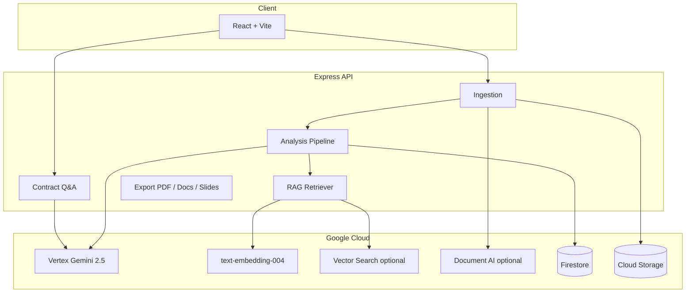

# LexGuard — System Architecture

## Overview

LexGuard is a full-stack contract intelligence platform: React client, Express API, Vertex AI (Gemini + embeddings), optional Document AI OCR, Firestore sessions, GCS uploads, and a local or managed vector index for benchmark RAG.



## Ingestion layer

| Input | Handler | Notes |
|-------|---------|--------|
| PDF | `pdf-parser.js` | `pdf-parse` first; if text-sparse, Gemini PDF OCR or Document AI |
| DOCX | `docx-parser.js` | Mammoth extraction |
| Images | `ocr.js` | Gemini vision default; Document AI fallback |
| Plain text / paste | Direct | UTF-8 |
| URL | `url-fetcher.js` | Fetch + optional Jina reader fallback |

## Analysis pipeline

1. **Classify** — `classify-document.js` → document type + signing party (Gemini JSON).
2. **Extract** — `extract-clauses.js` + per-type schema (`schemas/*.js`) → clause segments + missing high-risk categories.
3. **Analyze** — `clause-analyzer.js` per clause: RAG benchmarks → combined Gemini JSON (classifier, implication, comparator, orchestrator).
4. **Cross-clause** — `cross-clause-analyzer.js`: deterministic heuristics **always**; Vertex merge when `LEXGUARD_CROSS_CLAUSE_AI` ≠ `false`.
5. **Score** — `pipeline.js` weighted severity → `overallRiskScore` 0–100.
6. **Persist** — Firestore session; SSE progress to client.

## RAG design

- **Corpus**: `corpus/<document_type>/<category>.txt` — market-style benchmark clauses.
- **Index**: `npm run embed-corpus` → `corpus/.vector-index.json` (gitignored).
- **Retrieval**: embed clause text → cosine similarity → top-K benchmarks injected into analysis prompt.
- **Optional**: Vertex Vector Search for production scale (`sync-vector-search.js`).

## Client architecture

- **Routes**: Upload → Analyzing (SSE) → Report workspace.
- **Report**: Document viewer with highlights, clause list, insight panel, risk radar, ambiguity panel, contextual chat, export bar.
- **Shared**: `src/shared/` — clause normalization, cross-clause heuristics, PDF quality helpers.

## Deployment

- **Dev**: Vite proxy to Express `:3050`.
- **Prod**: `npm run build` + `node src/server/index.js` serves `dist/`.
- **Cloud Run**: Dockerfile; service account IAM; secrets via env — never bake keys into images.

## Security

- Secrets in `.env` / Secret Manager only.
- CORS configurable for production origins.
- Contracts may contain PII — use isolated GCP projects for demos.
- Outputs are **not legal advice** (see UI disclaimer).

## Module map

```
src/server/modules/
  ingestion/     # parsers, OCR, URL
  extraction/    # classify, schemas, extract-clauses
  analysis/      # pipeline, clause-analyzer, cross-clause, negotiation
  rag/           # embeddings, retriever, vector-store, corpus loader
  export/        # PDF, Google Docs/Slides
```
